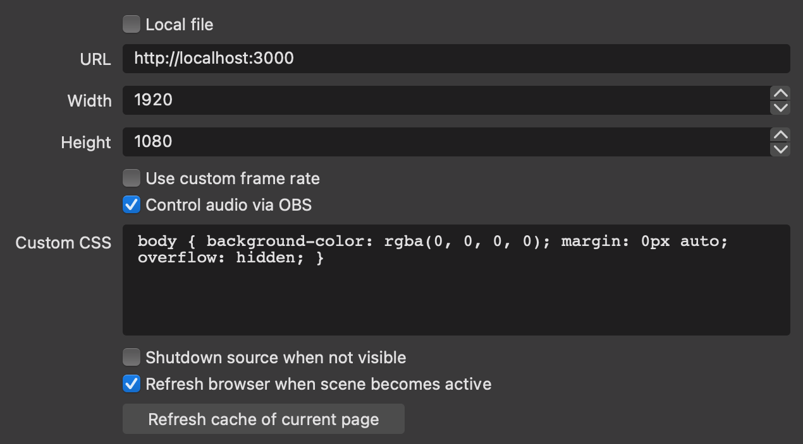

# preyneyv's Replay Manager

A way to get a much nicer-looking instant replay working in free open
source software.

This is a spin-off of [FFConcat Replay Manager](https://github.com/preyneyv/ffconcat-replay)
that takes a completely different approach to rendering the replays. Where the
previous one relied on ffconcat to create the stitched-together replay video,
this uses a browser source that pieces the videos together in real-time. This
eliminates the stuttering between clips in the previous one while also adding
a simple cross-fade transition.

**Some of these screenshots are slightly incorrect or have FFCRM branding. I
will fix it eventually, but bear with me for now.**

**Note**:
I wrote this program for a very specific use-case I had, but I thought it might
be beneficial to other people in a similar situation to mine. I mention this to
make it clear that *this project will **NOT** be actively maintained.* You are
free, however, to fork it and do with it what you please.

**Disclaimer:** I cannot guarantee the software will work 100% of 
the time. In my own testing, it has worked fine to the point that I am
comfortable offering it as a tool to the community. However, I do not take any
responsibility of any kind for anything that goes wrong due to the usage of
this software. Refer to [LICENSE](LICENSE) for the full disclaimer.

I've written the reasoning for the existence of pRM and FFCRM (I need a better
abbreviation) at the bottom of the [FFRCM Readme](https://github.com/preyneyv/ffconcat-replay#why-does-this-exist-and-how-does-it-work) if you're interested
in more background. 

## Instructions

### Setup
#### In OBS Studio's Settings
1. `Output > Replay Buffer`  
Enable the Replay Buffer and set the replay time to the desired length.    

2. `Output > Recording`  
Ensure the recording path is on an SSD, since we will be reading from and
writing to it very frequently and time-sensitively.  

3. `Hotkeys`  
Set up a hotkey for "Save Replay Buffer". This is your "something cool just
happened" button, so make sure it isn't a button you normally use.  

4. `Advanced`  
Set your Replay Buffer Filename Prefix to something. This can literally be 
anything, but it helps if it's something simple like "Replay". We will need
this later.  

#### In preyneyv's Replay Manager
Note that pRM will remember your settings and pre-fill them for you the next
time you open it.

_(The following screenshot is incorrect.)_

- **Session Directory**  
Where all your recordings are stored. This is the same as what is listed as the
recording path in your OBS settings.
- **Client Port**  
The port number for the web server. `3000` works well for most people. If you 
have something else running on `3000`, just pick another open port.
- **Filter Pattern (RegEx)**  
How to isolate clips from full recordings. If you're not familiar with RegEx,
just use `<replay buffer prefix>.*` here. So if my Replay Buffer Prefix was
`Replay`, I would use `Replay.*`. Note that this is case-sensitive.
- **Tags**  
Up to 5 tags you can use to easily select the clips you want to stream. These
should be comma-separated. For example, `P1,P2,P3`. Space is optional. Short
tag names are recommended.

Click `Start` when you are done with the configuration. You might get a prompt 
asking for network access permission. You need to grant this to let OBS connect
to the viewer.

#### Final Configuration
1. Create a new scene for the replay. (Probably call it "Replay".)
2. In pRM, click `Copy Viewer URL`.
2. Add a Browser Source and configure it as follows.  

   - `URL` Paste the URL that was copied by pRM.
   - `Width` and `Height` are the dimensions of the replay window. Normally, 
   these should just be the dimensions of your OBS canvas.
   - `Control audio...` should be **enabled**. This lets you independently control
   the volume of the replay and it shows up as a separate audio device in the
   `Audio Mixer`.
   - `Shutdown source...` should be **disabled**. This messes with some internal
   stuff on the viewer's end.
   - `Refresh browser...` should be **enabled**. This way, every time you
   switch to the replay scene, it will fetch the latest clip playlist instead
   of using a cached one.

And with that, setup is over!

### Usage

**Note**: Although this is copied over from the previous repository, it still
works pretty much exactly the same.

pRM will continuously watch the provided Session Directory for new clips.
Whenever something interesting happens, press your "Save Replay Buffer"
shortcut to create a new clip. You should see it pop up at the bottom of
pRM's clip list.

At any point, you can return to the configuration by clicking the application's
title. Note that this will unhide all clips again when you return.

Clicking a row will toggle its selection. Once you have selected all the clips
you would like to show, click `Enqueue` to update the playlist. **Note that 
this will NOT change the OBS scenes for you.** You still have to do that
yourself. It will only update the playlist file so that the next time the 
replay scene is pulled up, the new clips are shown. You can also click `Clear`
to clear the current selection.

You can hide clips that you no longer want to see by clicking the `Hide` button
on each row. You can also hide all clips that are currently visible by clicking
`Hide All`. Neither of these actions will delete the clips from your disk. They 
will simply hide them from the interface. One case where you might want to do
this is when you proceed between matches. You no longer need to see the 
highlights of the previous match, so clearing the list would make it easier to
select clips. You can reveal _all_ hidden clips by clicking `Show All`. There 
is currently no way to reveal a single hidden clip.

You can tag the new clip with any of the tags defined in configuration by
clicking their respective bubbles to toggle them. Tagging allows for easier
selection of the clips using the `Select` filters at the top left. 

---
Built by @preyneyv in 2021.